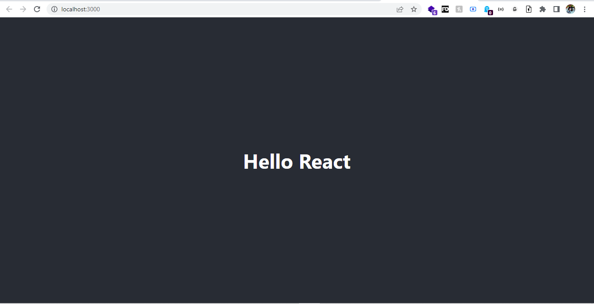

# Hello World React Application

## How to install

1. git clone https://github.com/iamRajatSharma/Hello-React.git
2. cd ./Hello-React
3. npm update
4. npm start

Runs the app in the development mode.\
Open [http://localhost:3000](http://localhost:3000) to view it in your browser.

The page will reload when you make changes.\
You may also see any lint errors in the console.

### `Demo`
